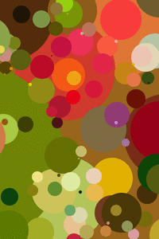

# Unnamed Circle Project

Naming things is hard. This is a Rust project which takes an input image
and tried to recreate it by layering multicoloured circles on a blank
canvas. 

The code can be compiled into a WebAssembly package and used in a browser. 
[Check it out here](https://circles-lovat.vercel.app/).
The frontend code is in the `frontend` directory.
