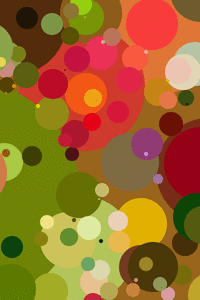
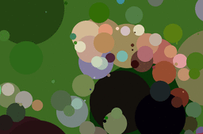

# Full Circle

This is a Rust project which stylizes an image in real-time. The program uses an evolutionary 
algorithm which approximates the input by layering multicoloured circles on a blank
canvas. [Check it out here](https://circles-lovat.vercel.app/).

## Examples

